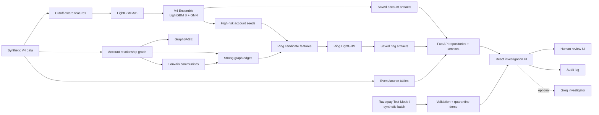

<div align="center">


# RingWatch

### Explainable detection and investigation of coordinated refund abuse rings

Defense-only risk intelligence for post-delivery refund, return and chargeback abuse.

<br />

<a href="https://razorpay.com/buildathon/">Razorpay AI Buildathon</a> · Track 02: AI Risk Manager · Abuse-ring sentinel

<br /><br />


</div>

---

## Why RingWatch

Refund and return abuse is rarely a single-account problem. A customer can look ordinary in isolation while the surrounding network reveals reused devices, phones, payment instruments, addresses, IP prefixes, coupons, synchronized activity and repeated refund behavior.

RingWatch turns those signals into an investigator workflow:

> **Detect → connect the evidence → explain the score → verify the evidence → recommend a bounded action → audit the investigation**

The system is intentionally defense-only. It prioritizes cases for review; it does not automatically declare a customer fraudulent, deny a refund, seize funds or execute an irreversible action.

## Razorpay AI Buildathon | Track 02

RingWatch is built for **[Razorpay AI Buildathon — Build. Show. Get hired.](https://razorpay.com/buildathon/)**, **Track 02: AI Risk Manager**.

### Track fit

| Buildathon requirement | RingWatch implementation |
|---|---|
| Stop merchant losses from fraud, returns and chargebacks | Targets coordinated post-delivery refund/return abuse and surfaces dispute evidence gaps. |
| Build a working detector / verifier / auto-responder for one loss class | Primary use case is an **abuse-ring sentinel** with account-level risk ranking and a second-stage ring detector. |
| Measured precision and recall on a held-out test set | Ring-level detector test: **50.0% precision, 90.9% recall, F1 64.5%**, with 10 false positives and 1 false negative at the selected threshold. |
| Include false-positive cost | Ring model reports **₹2,000 FP cost** and **₹15,000 FN cost**; held-out test operating cost is **₹35,000**. |
| Defense-only | Model outputs are investigation priorities; bounded actions require human review for high-risk cases. |
| Show the work | This repository includes the data-generation pipeline, feature engineering, graph construction, models, saved evaluation artifacts, API, UI, tests and architecture documentation. |

### The result in one line

**RingWatch finds coordinated refund-abuse candidates, shows why they are suspicious, shows what evidence is missing, and gives an investigator a bounded next action instead of an opaque block/allow decision.**

---

## What the shipped system actually does

RingWatch has two related offline model layers and one artifact-backed application layer.

### 1. Account risk layer

A cutoff-aware feature pipeline builds behavioral, temporal and identity-reuse features for **30,000 synthetic accounts**. The account model stack includes tuned LightGBM variants and a GraphSAGE model over the account relationship graph. The **V4 operating score** exposed by the application is the saved ensemble of **tuned LightGBM B + GraphSAGE**.

### 2. Ring candidate layer

The ring detector is a separate model, not a rename of the account classifier:

1. Score accounts with the saved tuned **LightGBM B** account model.
2. Seed candidates from high-risk accounts and strong graph relationships.
3. Aggregate member risk, graph density, shared-identity edges, refund/return behavior, disputes, burst signals and community context.
4. Score each candidate with a dedicated **LightGBM ring model**.
5. Return ranked ring candidates, member rankings, strongest relationships and an investigation-priority tier.

The current V4 artifact contains **173 ring candidates**, including **80 positive candidates** under the synthetic ground truth used for evaluation.

### 3. Investigation application

The FastAPI backend reads persisted CSV/JSON/model artifacts at startup and through repositories/services. The React frontend provides dashboards and investigation workflows around those artifacts.

The runtime **does not retrain models, rebuild the graph or recompute the feature matrix per API request**.

---

## Architecture at a glance



For the detailed implementation diagram and runtime boundaries, see **[docs/architecture.md](docs/architecture.md)**.

---

## System workflow

```text
Synthetic commerce data
        │
        ├── behavioral / temporal / identity features ──┐
        │                                                │
        └── shared-identity account graph ───────────────┤
                                                         ▼
                                            Account risk models
                                                         │
                                         V4 LightGBM B + GraphSAGE
                                                         │
                                        high-risk account prioritization
                                                         │
                         ┌───────────────────────────────┴──────────────────┐
                         ▼                                                  ▼
                account investigation                              ring candidate generation
                         │                                                  │
       SHAP + graph evidence + timeline +                     aggregate graph / behavior / exposure
       dispute evidence + financial exposure                              │
                         │                                                  ▼
                         │                                        Ring LightGBM detector
                         │                                                  │
                         └──────────────────────────┬───────────────────────┘
                                                    ▼
                                        bounded policy recommendation
                                                    │
                                      human review + audit trail
```

### Evidence signals used in the graph

| Relationship | Weight | Interpretation |
|---|---:|---|
| Shared device | 1.0 | Strong shared-identity signal |
| Shared payment instrument | 1.0 | Strong shared-financial-credential signal |
| Shared phone | 1.0 | Strong identity-reuse signal |
| Shared address | 0.7 | Moderate identity/location reuse |
| Shared IP prefix | 0.3 | Weak contextual network signal |
| Shared rare coupon | 0.2 | Weak behavioral linkage |

These are **evidence-prioritization heuristics**, not proof of common ownership, coordination or abuse.

---

## Dataset and offline artifacts

The current V4 synthetic dataset contains:

| Artifact | Size |
|---|---:|
| Accounts | 30,000 |
| Orders | 75,985 |
| Refund records | 14,366 |
| Disputes | 718 |
| Addresses | 19,940 |
| Devices | 24,740 |
| Phones | 25,340 |
| Payment instruments | 30,740 |
| Account graph edges | 56,213 |
| Ring ground-truth rows | 30,000 |
| Synthetic true ring members | 1,500 |
| Ring candidates | 173 |

The prediction cutoff used by the V4 leakage/audit artifacts is **2026-02-20 00:00:00**. Feature and graph leakage reports in `data/v4_realistic_30k/processed/` confirm that ground truth is not used for feature generation and that the graph is built from pre-cutoff information.

Older `v1_1k` and `v3_scaled_30k` directories remain as experiment artifacts. The application configuration points to `data/v4_realistic_30k`.

---

## Models and evaluation

### Primary account model: V4 Ensemble

The application uses the saved **V4 Ensemble**, averaging the tuned LightGBM B probability with the GraphSAGE probability.

Held-out account test results from `ensemble_metrics.json`:

| Metric | Value |
|---|---:|
| Threshold | 0.6831 |
| Precision | 35.64% |
| Recall | 48.21% |
| F1 | 40.99% |
| ROC AUC | 0.8406 |
| PR AUC | 0.4443 |
| False positives | 195 |
| False negatives | 116 |
| Total test cost | ₹2.13M |

### Track 02 ring detector

The ring detector is the most directly relevant evaluation for the buildathon track.

Held-out ring-candidate test results from `ring_metrics.json`:

| Metric | Value |
|---|---:|
| Test candidates | 27 |
| Positive candidates | 11 |
| Threshold | 0.03 |
| Precision | **50.0%** |
| Recall | **90.91%** |
| F1 | **64.52%** |
| ROC AUC | 0.8239 |
| PR AUC | 0.8141 |
| True positives | 10 |
| False positives | 10 |
| True negatives | 6 |
| False negatives | 1 |
| False-positive cost | ₹2,000 |
| False-negative cost | ₹15,000 |
| Held-out test cost | **₹35,000** |

Candidate generation itself represented **99 of 140** synthetic true rings overall. On the ring-model test split, **8 of 9** true rings were detected, giving **88.9% ring coverage** for that split.

### Why these numbers need context

All metrics are produced from synthetic data. They are useful for evaluating the implementation and demonstrating the methodology, but they are **not production fraud-detection performance claims**.

The account and ring splits keep the same synthetic abuse-ring IDs together across train/validation/test. Thresholds are selected using validation data. The ring model's own leakage report confirms that ground-truth IDs are used only for labels/split grouping and not as model input features.

---

## Explainability and investigation

For an investigated account, the backend can assemble:

- model risk score and risk tier
- SHAP feature attribution
- shared device / address / phone / payment relationships
- graph evidence and network context
- order, return, refund and dispute timeline
- financial exposure from source order data
- dispute evidence availability and missing evidence fields
- a saved case report
- a deterministic bounded action recommendation
- an investigation audit event

### Optional AI investigator

When a Groq key is configured, the investigation service can use a Groq LLM with tool-calling against RingWatch's deterministic tools for related accounts, shared attributes, evidence availability, financial exposure, timeline and merchant policy context.

The LLM **does not choose the final action**. The action comes from the deterministic policy engine. When Groq is unavailable or fails, the service returns a deterministic fallback path.

---

## API reference

The FastAPI application uses `/api` as its application prefix. It also exposes the standard FastAPI OpenAPI/Swagger/ReDoc endpoints at `/openapi.json`, `/docs` and `/redoc`.

| Method | Endpoint | Use |
|---|---|---|
| GET | `/health` | Liveness check and service/version response. |
| GET | `/ready` | Readiness check plus required artifact locations. |
| GET | `/api/queue` | Return the ranked account investigation queue. Supports `limit`. |
| GET | `/api/accounts/{account_id}` | Return account risk, features and assembled investigation detail. |
| GET | `/api/accounts/{account_id}/feature-ablation` | Return saved held-out feature-sensitivity results for the account. |
| GET | `/api/accounts/{account_id}/graph` | Return graph nodes and edges for account-level visualization. |
| GET | `/api/accounts/{account_id}/evidence` | Return dispute evidence availability and missing evidence count. |
| GET | `/api/accounts/{account_id}/report` | Return the saved case-report text for the account. |
| GET | `/api/accounts/{account_id}/action` | Return the deterministic bounded action recommendation for the account. |
| GET | `/api/accounts/{account_id}/timeline` | Return chronological order, delivery, return, refund and dispute events. |
| POST | `/api/accounts/{account_id}/investigate` | Run the optional AI investigator with deterministic fallback and audit logging. |
| GET | `/api/graph/overview` | Return the broader account graph/community visualization data. |
| GET | `/api/rings` | List scored ring candidates. Supports `limit` and `detected_only`. |
| GET | `/api/rings/{candidate_id}` | Return ring members, member risk scores, internal edges and ring evidence. |
| GET | `/api/metrics` | Return model benchmarks, operating model information and investigation summary. |
| GET | `/api/metrics/feature-ablation` | Return the held-out feature-sensitivity benchmark. |
| GET | `/api/metrics/curves` | Build top-K precision/recall/cost curves from saved test predictions. |
| GET | `/api/audit` | Return investigation audit records. |
| DELETE | `/api/audit` | Clear the demonstration investigation audit log. |
| POST | `/api/address/extract` | Extract structured address components from a raw address. |
| POST | `/api/address/verify` | Verify/score a supplied structured address against the raw address. |
| POST | `/api/address/normalize` | Normalize a raw address, optionally using supplied structured components. |
| POST | `/api/failure-demo/razorpay` | Fetch a Razorpay Test Mode batch and run validation/quarantine handling. |
| POST | `/api/failure-demo/razorpay-synthetic` | Generate a deterministic malformed Razorpay-shaped batch and run the same validation path. |
| POST | `/api/failure-demo` | Backward-compatible alias for the synthetic malformed-batch demo. |

### API notes

- Account/ring scoring is artifact-backed. These endpoints read saved predictions/model artifacts rather than training during the request.
- The failure-demo endpoints demonstrate ingestion validation and quarantine. They do **not** inject the incoming records into the current account/ring model pipeline.
- Address endpoints form a separate normalization/verification workflow and are not part of the ring score.

---

## Frontend

The React/Vite application exposes these user-facing routes:

| Route | Purpose |
|---|---|
| `/` | Product landing page and architecture/product overview. |
| `/dashboard` | Ranked account-risk queue. |
| `/live` | Live-ops style monitoring view over the saved queue/audit/graph data. |
| `/investigations/:accountId` | Full account investigation workspace. |
| `/rings` | Ring candidate detector and network/community exploration. |
| `/audit` | Investigation audit history. |
| `/metrics` | Model performance, curves and feature-sensitivity analysis. |
| `/failure-demo` | Razorpay Test Mode/synthetic validation and quarantine demonstration. |
| `/address-normalization` | Structured address extraction, verification and normalization workflow. |
| `/verification/:accountId` | Presentation-only verification workflow. |
| `/human-review/:accountId` | Presentation-only human-review workflow. |
| `/about` | Product, pipeline and technology overview. |

The verification and human-review screens are currently **presentation workflows**. Their UI buttons do not persist a reviewer decision to the backend.

---

## Repository layout

```text
RingWatch/
├── backend/
│   ├── api/                  FastAPI routers / HTTP boundary
│   ├── core/                 config, logging, middleware, concurrency
│   ├── domain/               domain dataclasses
│   ├── repositories/         artifact/data access
│   ├── schemas/              Pydantic API contracts
│   ├── services/             queue, account, graph, evidence, action, LLM, etc.
│   └── tests/                API + address-normalization tests
├── generator/
│   ├── realistic_engine.py   V4 synthetic dataset generator
│   ├── features.py           cutoff-aware account features
│   ├── graph_features.py     account graph + Louvain communities
│   ├── lightgbm*.py          LightGBM baseline/tuning
│   ├── gnn_model.py          GraphSAGE training/evaluation
│   ├── ensemble.py           V4 account ensemble
│   ├── ring_model.py         ring candidate generation + ring LightGBM
│   ├── *ablation.py          sensitivity / ablation experiments
│   └── quality_audit.py      dataset quality/leakage checks
├── data/v4_realistic_30k/
│   ├── *.csv                 V4 synthetic source tables
│   └── processed/            graph, features, explanations, metrics, models
├── frontend/
│   └── src/                  React UI, API clients and assets
├── docs/architecture.md      implementation architecture and runtime boundaries
├── scripts/                  Razorpay-shaped batch helper
├── pyproject.toml            Python dependencies + pytest config
└── uv.lock                   locked Python environment
```

---

## Getting started

### Prerequisites

- Python **3.13+**
- [uv](https://docs.astral.sh/uv/)
- Node.js + npm

### 1. Install the backend

```powershell
uv sync
```

### 2. Start the FastAPI backend

From the repository root:

```powershell
uv run uvicorn backend.main:app --reload
```

Health check:

```powershell
curl http://127.0.0.1:8000/health
```

Interactive API docs:

```text
http://127.0.0.1:8000/docs
```

### 3. Start the frontend

In a second terminal:

```powershell
cd frontend
npm install
npm run dev
```

The default frontend URL is:

```text
http://localhost:5173
```

Set `VITE_API_BASE_URL` when the backend runs somewhere other than `http://localhost:8000`.

### 4. Optional Groq investigator

Set these environment variables in `.env` when you want the LLM-assisted investigation path:

```text
GROQ_API_KEY=...
GROQ_MODEL=llama-3.3-70b-versatile
```

The application still works without a Groq key because the investigation service has a deterministic fallback.

### 5. Optional Razorpay Test Mode demo

Set Razorpay Test Mode credentials when you want the real Test Mode batch path:

```text
RAZORPAY_KEY_ID=...
RAZORPAY_KEY_SECRET=...
```

Without credentials, use the synthetic failure-demo endpoint from the UI.

---

## Regenerating the V4 offline artifacts

Rebuild the synthetic data/model stack in this order:

```powershell
uv run python -m generator.generate_dataset
uv run python -m generator.features
uv run python -m generator.graph_features
uv run python -m generator.lightgbm
uv run python -m generator.lightgbm_tuned
uv run python -m generator.gnn_model
uv run python -m generator.ensemble
uv run python -m generator.ring_model
uv run python -m generator.feature_ablation
```

Useful validation/analysis helpers also exist in `generator/validate.py`, `generator/quality_audit.py`, `generator/ring_ablation.py`, `generator/analysis.py` and `generator/plot_curves.py`.

Re-run the API after replacing artifacts so its startup checks and cached readers use the new files.

---

## Testing

The current backend test suite covers the HTTP/API and address-normalization flows.

```powershell
uv run pytest -q backend/tests/test_api.py backend/tests/test_address_normalization.py
```

At the time of this audit, the suite passes with **31 tests**.

For the frontend, install dependencies before running the Vite build:

```powershell
cd frontend
npm install
npm run build
```

---

## Razorpay integration boundary

RingWatch includes a Razorpay Test Mode adapter and a deterministic malformed-batch demonstration because the buildathon story benefits from showing what happens when upstream payment data is incomplete or malformed.

The shipped flow is:

```text
Razorpay Test Mode / synthetic batch
              ↓
        schema validation
              ↓
       valid / quarantined
              ↓
       failure-demo result
              ↓
       UI + audit presentation
```

It is **not** currently:

```text
Razorpay event
    → persistent event store
    → canonical event mapping
    → feature recomputation
    → graph update
    → model rescoring
```

A production implementation would add signed webhook verification, idempotent event storage, canonical event mapping, background feature/graph updates and versioned rescoring.

---

## Safety, limitations and honest framing

RingWatch is deliberately conservative in what it claims:

- **Synthetic data only.** Dataset statistics, ring labels and model metrics are not production benchmarks.
- **Investigation aid, not a final fraud verdict.** Scores prioritize review.
- **Relationship weights are heuristics.** Shared identifiers are evidence, not proof of shared control.
- **SHAP is attribution, not causality.** A feature contribution explains model behavior, not the real-world cause of abuse.
- **Feature ablation is sensitivity analysis.** It is not causal evidence.
- **Ring recall is bounded by candidate generation.** A ring that never enters the candidate set cannot be recovered by the second-stage ring classifier.
- **GraphSAGE is evaluated on the persisted graph.** The result is graph-based offline evaluation, not evidence of generalization to unseen production graphs.
- **Human-review persistence is not finished.** The current review/verification pages are UI workflows rather than a durable approval system.
- **Razorpay ingestion is a separate demo path.** It is not live model ingestion in this version.

These boundaries are part of the design, not footnotes. The goal is to show a system that can be trusted enough to investigate, while being explicit about what is and is not production-ready.

---

## What is intentionally not claimed

RingWatch does not claim live fraud production performance, autonomous refund denial, production webhook ingestion, or durable human approvals in this version.

The project is a working, testable **AI risk-management prototype** that demonstrates a complete defense workflow: data → models → graph evidence → explainability → investigation → bounded action → audit.

---
