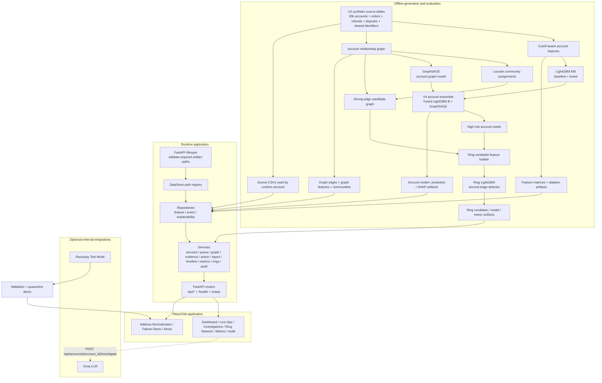
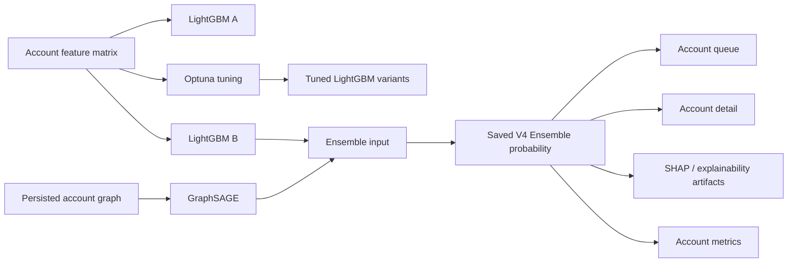
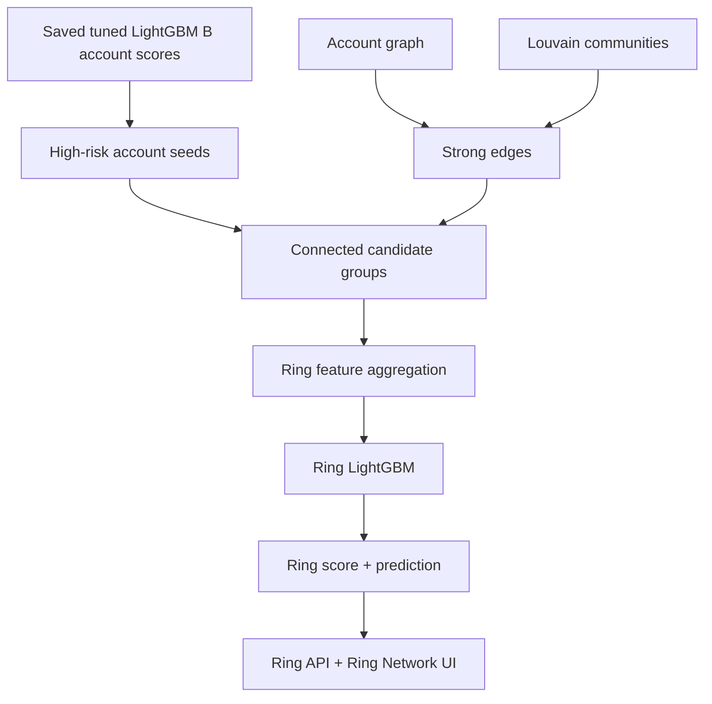
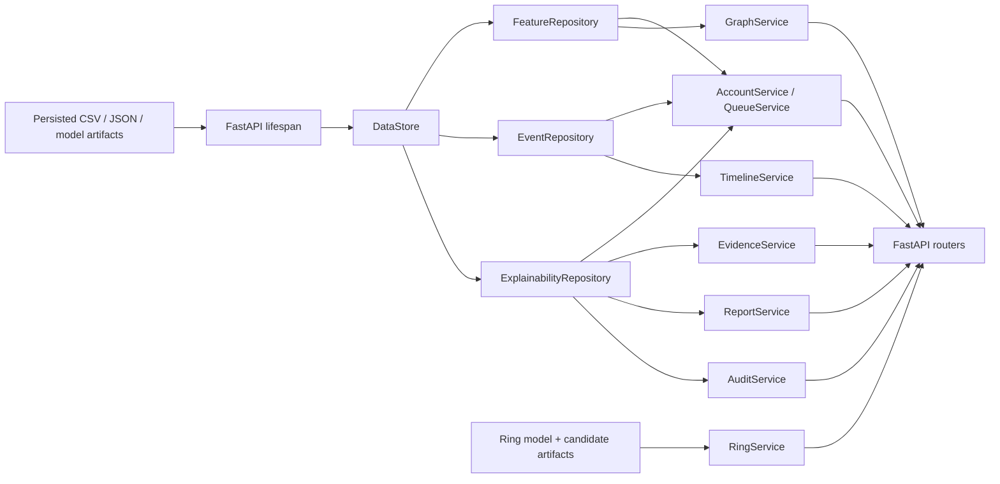
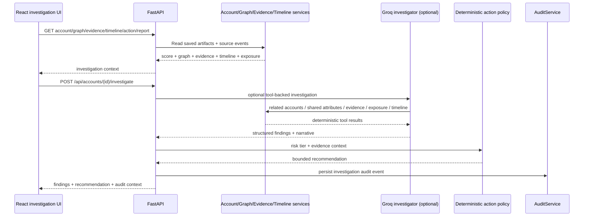
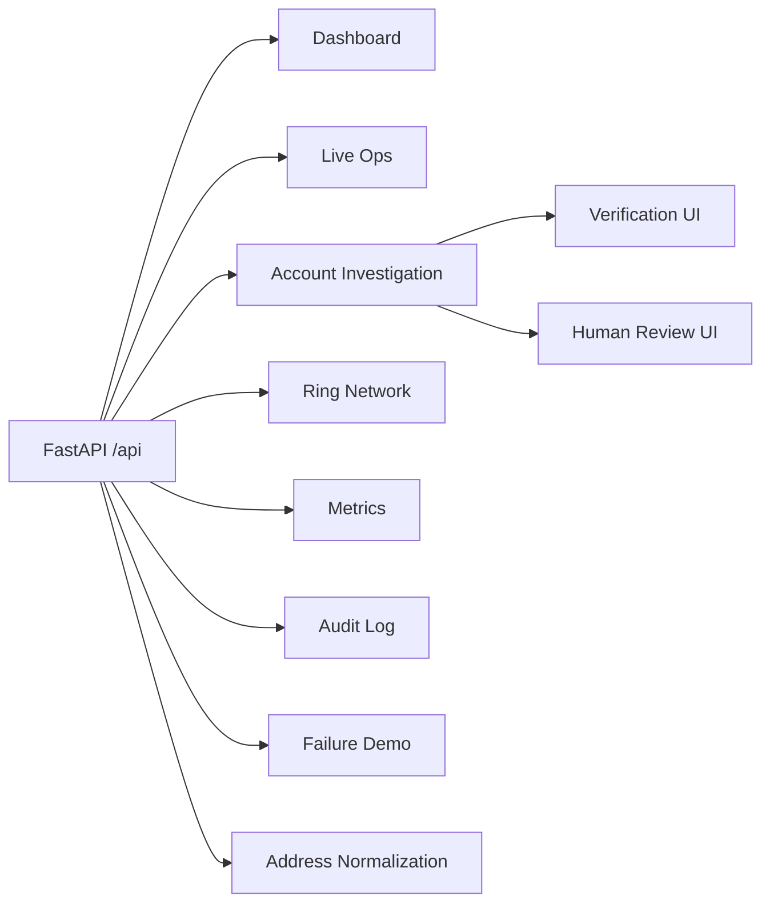
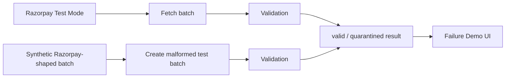
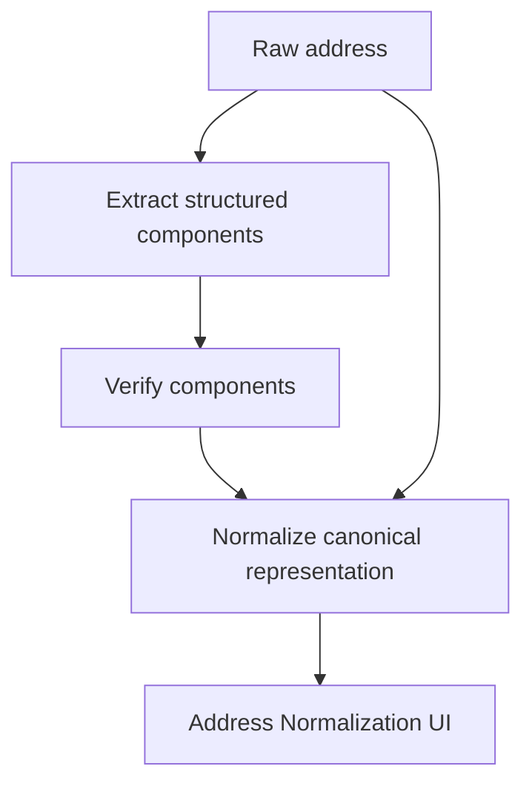

# RingWatch architecture

RingWatch is a defense-only, artifact-backed investigation prototype for coordinated post-delivery refund and return abuse. The shipped system has three distinct layers:

1. **Offline data + model generation**: synthetic commerce data, cutoff-aware features, identity graph, account models and a second-stage ring detector.
2. **Runtime investigation API**: FastAPI repositories/services that read persisted artifacts and assemble investigation responses.
3. **React application**: dashboards and investigation workflows over the API, plus separate address-normalization and Razorpay failure-demo experiences.

The architecture below describes the implementation that is actually present in the repository. It does not imply capabilities that are not wired up yet.

## 1. End-to-end system



### Key architectural point

The **account model** and **ring detector** are separate stages.

- The application operating score is the saved **V4 account ensemble**.
- The ring detector is seeded from high-risk accounts using saved tuned LightGBM B scores plus strong graph relationships, then uses its own LightGBM candidate model.
- A ring candidate therefore depends on candidate generation first and ring classification second. This is why ring-level recall is explicitly bounded by candidate generation.

## 2. Offline data and feature pipeline

### Source data

`generator/realistic_engine.py` builds the V4 synthetic population and source tables for:

- accounts
- devices
- addresses
- phones
- payment instruments
- orders
- refunds
- disputes
- synthetic ring ground truth

The V4 repository contains 30,000 account rows. The prediction cutoff recorded in the leakage/audit artifacts is `2026-02-20 00:00:00`.

### Cutoff-aware features

`generator/features.py` derives account-level signals without using post-cutoff information. The feature matrix includes behavioral, temporal and identity-reuse signals such as:

- order / delivery / return / refund / dispute rates
- 24-hour / 7-day / 30-day activity windows
- transaction and refund burst signals
- account-creation bursts
- distinct devices, addresses, phones and payment instruments
- account-per-identity reuse counts
- coupon / discount dependency signals
- shared-identity graph counts

The feature leakage report is an explicit artifact under `data/v4_realistic_30k/processed/` and states that ground truth is not used for feature generation.

### Account graph

`generator/graph_features.py` projects shared identifiers into an account-to-account graph and persists the graph edges plus community assignments.

| Edge type | Weight | Role |
|---|---:|---|
| Shared device | 1.0 | strong identity-reuse evidence |
| Shared payment instrument | 1.0 | strong shared credential evidence |
| Shared phone | 1.0 | strong identity evidence |
| Shared address | 0.7 | moderate location/identity evidence |
| Shared IP prefix | 0.3 | weak contextual evidence |
| Shared rare coupon | 0.2 | weak behavioral evidence |

These weights are evidence-prioritization heuristics. They do not prove that two accounts belong to the same person or that abuse occurred.

## 3. Account model stack



The runtime operating model is configured as `Ensemble_LGBM_B_GNN` with an operating threshold of approximately `0.6831`.

The held-out account test artifact reports:

- precision: `35.64%`
- recall: `48.21%`
- F1: `40.99%`
- ROC AUC: `0.8406`
- PR AUC: `0.4443`
- cost: `₹2.13M`

These are synthetic offline metrics, not production claims.

## 4. Ring candidate detector



`generator/ring_model.py` creates candidate groups around high-risk accounts over strong graph relationships, aggregates member-level and ring-level evidence, and trains the second-stage LightGBM ring model.

The candidate generator uses:

- account risk statistics
- internal edge count and density
- weighted shared-identity edge counts
- community context
- order amount / count aggregates
- returns / refunds / disputes
- activity bursts
- discount dependency
- shared-entity statistics

Synthetic ground-truth ring IDs are used only for labels and grouped split logic. They are not passed as candidate-model features.

Current V4 ring artifacts report:

- 173 candidate groups overall
- 80 positive candidates overall
- 27 held-out test candidates
- 11 positive held-out candidates
- threshold: `0.03`
- precision: `50.0%`
- recall: `90.91%`
- F1: `64.52%`
- ROC AUC: `0.8239`
- PR AUC: `0.8141`
- 10 false positives / 1 false negative
- FP cost: `₹2,000`
- FN cost: `₹15,000`
- held-out test cost: `₹35,000`

Candidate generation represented 99 of 140 synthetic true rings overall. In the ring-model test split, 8 of 9 true rings were detected, which is 88.9% test-ring coverage for that candidate-generation path.

## 5. Runtime data access



`backend/services/data_loader.py` validates required runtime artifacts during FastAPI startup. It does not eagerly load every CSV; repositories load the data they need.

This means the backend is **artifact-backed and request-oriented**, not a streaming feature store.

## 6. Investigation flow and policy boundary



### LLM boundary

`LLMInvestigatorService` can use Groq with tool calling. The available tools are deterministic RingWatch lookups/calculations for:

- related accounts
- shared attributes
- evidence availability
- financial exposure
- account timeline
- merchant policy context

The LLM provides a structured investigation narrative. **The LLM is not the action authority.** The deterministic policy service maps risk tier to a bounded action such as human investigation, step-up verification, refund hold pending review, or monitoring.

When Groq is unavailable or errors, the service falls back to a deterministic investigation response.

## 7. API layer

FastAPI registers the following route groups under `/api`:

| Group | Routes | Responsibility |
|---|---|---|
| Queue | `/queue` | Ranked account investigation queue |
| Accounts | `/accounts/{account_id}` and related child routes | Account detail, graph, evidence, report, action, timeline, ablation, investigation |
| Graph | `/graph/overview` | Global graph/community visualization |
| Rings | `/rings`, `/rings/{candidate_id}` | Ring candidate ranking and ring detail |
| Metrics | `/metrics`, `/metrics/curves`, `/metrics/feature-ablation` | Offline benchmark presentation |
| Audit | `/audit` | Investigation audit read/clear |
| Address | `/address/extract`, `/address/verify`, `/address/normalize` | Separate address normalization/verification workflow |
| Failure demo | `/failure-demo`, `/failure-demo/razorpay`, `/failure-demo/razorpay-synthetic` | Razorpay/Test Mode validation + quarantine demonstration |
| Health | `/health`, `/ready` | Liveness/readiness |

FastAPI also supplies the standard developer endpoints `/openapi.json`, `/docs` and `/redoc`.

## 8. Frontend boundary

The frontend is a React 19 + Vite application using React Router, Tailwind CSS, Framer Motion, Lucide and React Force Graph.



The verification and human-review screens are currently presentation workflows. They do not persist a reviewer approval/rejection to a backend decision store.

## 9. Razorpay and failure-demo boundary

The Razorpay path is intentionally separated from the model-scoring path in the current implementation.



The two paths are:

- `POST /api/failure-demo/razorpay`: fetch Test Mode records and validate them.
- `POST /api/failure-demo/razorpay-synthetic`: create a deterministic Razorpay-shaped batch with malformed records and run the same validation/quarantine logic.
- `POST /api/failure-demo`: backward-compatible alias for the synthetic malformed-batch demo.

The current implementation **does not**:

- persist incoming Razorpay events as canonical application events
- rebuild the account graph from incoming events
- recompute cutoff-aware features
- rescore accounts or ring candidates
- stream new scores into the dashboard

That separation is important for honest demo framing. A production ingestion architecture would place signed webhook verification, idempotent event storage, canonical mapping, feature/graph updates and versioned rescoring between payment events and the investigation layer.

## 10. Address normalization boundary

Address normalization is a separate subsystem and is not part of the ring score.



The service combines deterministic normalization logic, field aliases, abbreviation expansion and configured LLM assistance when available. The frontend exposes both structured-field entry and raw-address workflows so extraction can be checked against explicit components.

## 11. Audit and failure semantics

`AuditService` reads/writes the investigation audit artifact used by the demo. Investigation events can include model/investigation context without requiring a model probability on every event.

The audit log is therefore a **demonstration persistence layer**, not a production compliance event store.

The failure demo also has an explicit quarantine concept: malformed records are surfaced with failed fields and a review-oriented action rather than being silently accepted.

## 12. Evaluation and leakage boundaries

The repository contains explicit audit/leakage artifacts for the V4 dataset and models.

Important guarantees in the shipped artifacts:

- ground truth is not used to generate account features
- ground truth is not used to build graph relationships
- synthetic abuse rings are kept together across train/validation/test splits
- thresholds are selected on validation data
- test data is used for final evaluation
- ring ground-truth identifiers are excluded from ring model features
- community IDs are excluded from account model features

Important limitations remain:

- data is synthetic
- graph-based GNN evaluation is on the persisted graph
- ring candidate recall is bounded by candidate generation
- ablation is sensitivity analysis, not causal inference

## 13. Non-goals in the current version

The following are intentionally outside the shipped architecture:

```text
No autonomous refund denial
No automatic account blocking
No production webhook event store
No streaming feature computation
No online graph maintenance
No online model retraining
No durable reviewer approval workflow
No claim of production fraud-detection performance
```

RingWatch is therefore best understood as a **working end-to-end AI risk-management prototype**: offline detector → graph evidence → explainability → investigation → bounded action recommendation → audit presentation.
