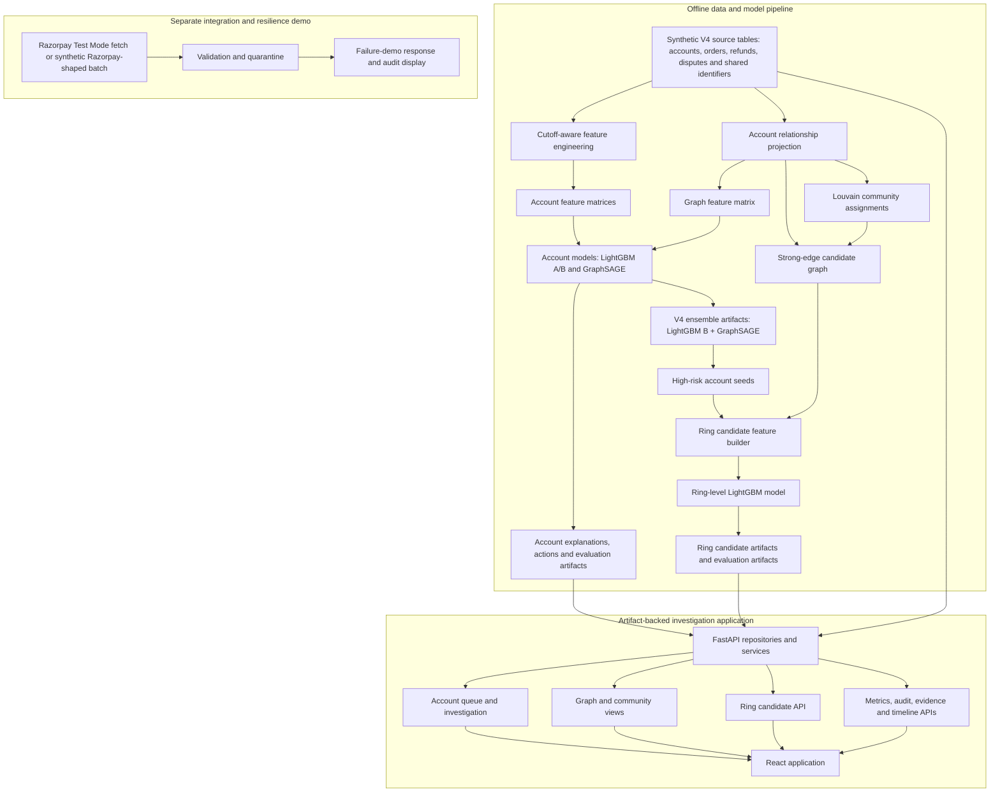
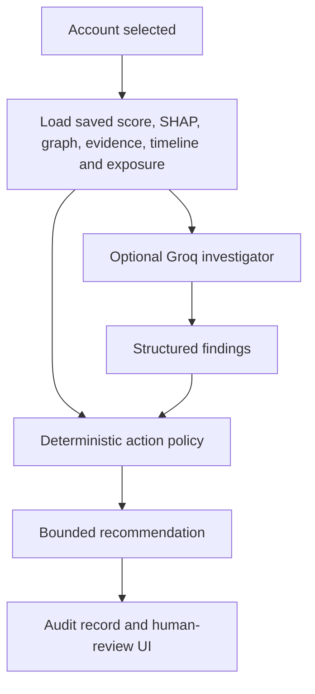

# RingWatch architecture

RingWatch is an offline, artifact-backed investigation prototype for coordinated post-delivery refund and return abuse. It combines account-level risk ranking with a separate ring-candidate model, then exposes the saved evidence through a FastAPI and React application.

## System overview



## Offline pipeline

### Synthetic dataset and graph

`generator/realistic_engine.py` creates the V4 dataset: accounts, devices, addresses, phones, payment instruments, orders, refunds, disputes and private ring ground truth. The synthetic population includes normal accounts, hard negatives and several seeded abuse-ring families.

`generator/features.py` filters information at the configured prediction cutoff before deriving behavioral, identity-reuse and temporal features. `generator/graph_features.py` projects account-to-account links from shared devices, payment instruments, phones, addresses, IP prefixes and rare coupons, then persists graph and community artifacts.

### Account-level models

`generator/lightgbm.py` and `generator/lightgbm_tuned.py` train LightGBM account classifiers. `generator/gnn_model.py` trains a GraphSAGE model on the account graph. `generator/ensemble.py` averages the tuned LightGBM B and GraphSAGE probabilities and saves ensemble evaluation and prediction artifacts.

The account models are evaluated with whole synthetic rings held together across train, validation and test splits. Their saved outputs drive the account queue, account details, SHAP displays, action recommendations and metrics pages.

### Ring-level candidate model

`generator/ring_model.py` adds a separate ring-candidate layer:

1. It scores accounts with the saved tuned LightGBM B model.
2. It builds connected candidate groups around high-risk accounts using strong graph edges and persisted community assignments.
3. It aggregates member risk, relationship, behavioral and community evidence into one candidate row.
4. It trains a LightGBM model that scores candidates as investigation priorities.
5. It saves candidate, prediction, metric, feature-importance and leakage-report artifacts.

Ground-truth ring identifiers are used for synthetic labels and grouped evaluation splits, not as ring-model input features. The ring API does not expose those labels.

## Application runtime

```mermaid
flowchart LR
    A[Processed CSV and model artifacts] --> B[FastAPI lifespan validates paths]
    B --> C[Repositories]
    C --> D[Account, graph, evidence, queue, metrics, audit and timeline services]
    C --> E[RingService]
    D --> F[/api/accounts, /api/queue, /api/graph, /api/metrics, /api/audit and related endpoints]
    E --> G[/api/rings and /api/rings/{candidate_id}]
    F --> H[React application]
    G --> H
```

The FastAPI application reads persisted artifacts; it does not retrain models or rebuild features at request time. `RingService` loads saved ring-model and candidate artifacts to return ring summaries, member rankings, internal edges and investigation-priority recommendations.

The React application provides a dashboard, account investigation, graph/ring exploration, metrics, audit log, failure demo and address-normalization views. The Rings view uses community context and can surface ring-candidate scores when ring artifacts are available.

## Investigator and action boundary



The LLM investigator is optional. When it is unavailable, the service returns a deterministic investigation path. The recommendation is determined by the bounded policy, not by the LLM. The current human-review and verification screens are presentation workflows; they do not yet submit or persist a reviewer decision.

## Razorpay and failure-demo boundary

The failure demo fetches Razorpay Test Mode records when credentials are configured, or creates a deterministic synthetic Razorpay-shaped batch. It validates records, quarantines malformed rows and returns a demonstration result.

This path is separate from model scoring: it does not currently write canonical events, rebuild the graph, recompute features or change account/ring scores. A production integration would add signed webhook ingestion, idempotent event storage, feature/graph updates and versioned rescoring between validation and the investigation APIs.

## Important boundaries

- Relationship weights prioritize evidence for investigation; they are not proof of coordination or abuse.
- SHAP explains model attribution, not causality.
- The dataset and performance numbers are synthetic and are not production performance claims.
- Account and ring models use stored offline artifacts. Their evaluation is ring-aware but not a future-time production validation.
