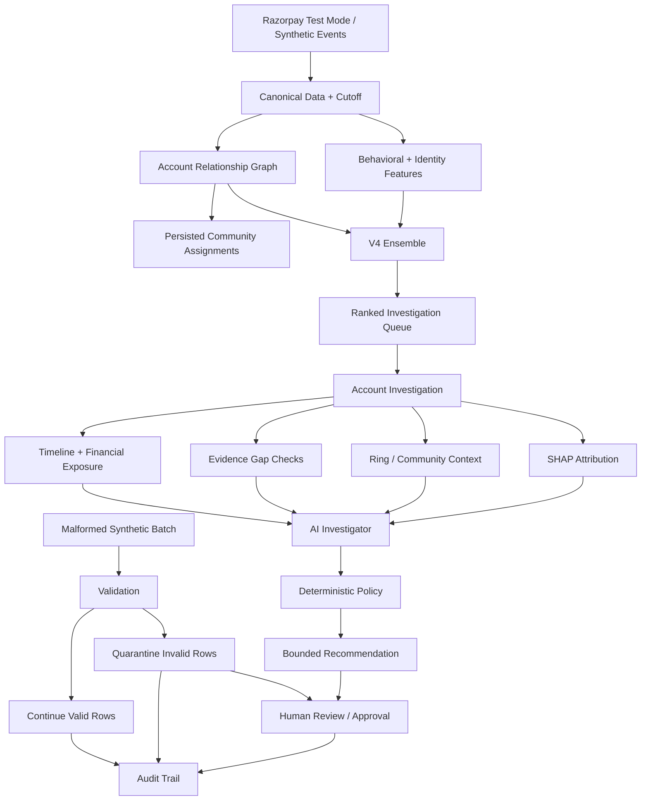

# RingWatch Architecture

## Model boundary

- **Risk model:** V4 Ensemble (tuned LightGBM B + GNN).
- **Explainability:** SHAP for model attribution.
- **Investigator:** optional LLM-assisted evidence synthesis with deterministic fallback.
- **Policy:** deterministic and bounded.
- **Human:** required for consequential review actions.

## Community boundary

The Rings UI consumes persisted `community_id` assignments when available. This avoids silently replacing the offline community definition with a different client-side graph partition. Older graph artifacts without assignments use a connected-component fallback.
